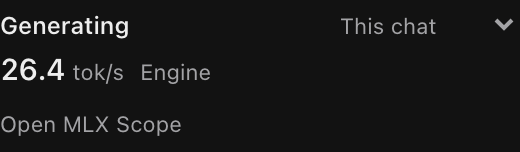
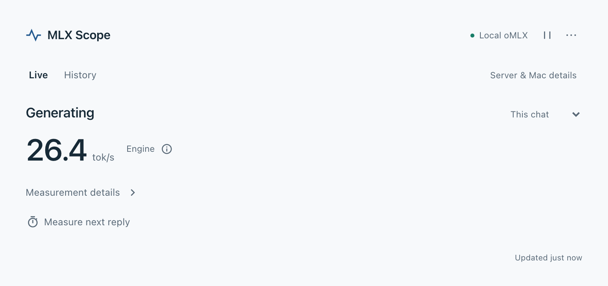
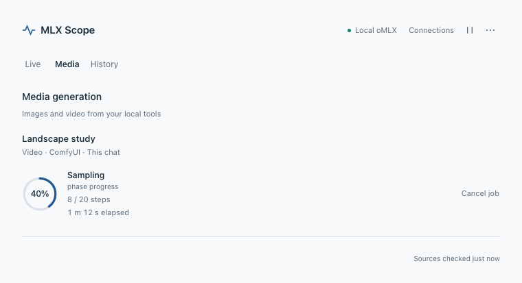

# MLX Scope

Lightweight chat and local media monitoring for OpenChamber.

**3.1 release candidate:** the media and setup improvements below are in the candidate branch. The latest public release remains 3.0.0 until 3.1 is published.

MLX Scope keeps honest runtime readings beside your conversation. It observes oMLX, Splash in Bionic, LM Studio,
llama.cpp `llama-server`, Ollama, vllm-mlx, mlx-lm and standalone Splash through their supported passive APIs, plus the
Mac they run on. It never sends inference, loads or unloads a model, or starts a runtime. The Session sidebar follows your chat and presents one relevant reading. Optional, clearly labeled chat delivery
estimates supplement native engine measurements; missing measurements leave no empty rows. Every value identifies
its source and scope. Live estimates, native throughput and completed-reply averages remain separate. Cloud chats receive the same delivery estimates on qualified OpenCode runtimes, labelled **Cloud · est.**; they include network and provider buffering and never borrow a local engine's reading. Local media progress stays available in all cases.

| Runtime | Readings |
| --- | --- |
| **oMLX** | Prompt progress, remaining work and time estimate, generation and recent output speed, context and reuse, model activity, cache, process footprint, and a 7/30/90-day usage card "Recorded by oMLX" |
| **Splash via Bionic** *(recommended for Splash)* | Your Splash models with a Splash badge and which one is loaded; live prompt reading and generating; exact tok/s, first-token time, context use and input reuse for each finished response; loaded instances and an Engines card from `lms` |
| **LM Studio** | Available and loaded models, format and context limits; with the `lms` CLI installed, the same live request state and exact per-response figures as Bionic |
| **llama-server** | Health, context, model and slots, with live speed while exactly one slot is busy; server rates and speculative-decoding acceptance with `--metrics` |
| **Ollama** | Which models are resident, their GPU-resident size as Ollama reports it, and when each unloads. Ollama reports residency only |
| **vllm-mlx** | Reported request activity, queue, output and speed; prefill and reuse where the engine exposes usable data |
| **mlx-lm** | Server availability and the available model catalogue |
| **Splish / Splash (standalone)** | Real prompt progress with the optional OpenCode companion, plus separate recent prefill and generation speeds across all requests in the main view and Session widget; each stage's actual 2–5-second observation interval and average since engine start in the full view; loaded model and context, idle/generating/recovering state, typical and slow first-token and between-token times from Splash itself, completed/failed counters, vision chips, and GPU (Metal) memory now/peak |

On macOS, every runtime also gets host readings: CPU, memory, swap, the kernel's memory pressure level, the GPU
wired-memory limit, GPU busy and GPU memory as the graphics driver reports them, thermal pressure, and optionally a chip
power estimate. OpenAI-compatible inference does not imply equivalent monitoring; see [Compatibility](docs/COMPATIBILITY.md).

### Using Splash in Bionic

1. Keep Bionic's Local Model API on (for example `http://127.0.0.1:1234/v1`) and add it as a provider in OpenChamber or OpenCode.
2. Make sure Bionic's `lms` command-line tool is installed (`~/.lmstudio/bin/lms`) for live request activity.
3. Open MLX Scope and leave the connection on **Automatic**. It shows "Splash via Bionic". Don't choose the standalone Splash runtime; that is only for `splash serve`.

## Where MLX Scope shows up

- **Session sidebar.** Activity leads, followed by one relevant reading, an available supporting fact and **Open MLX Scope**. OpenChamber already
  shows the selected model, so the sidebar does not repeat it.
  Prompt progress appears while reading; speed appears while generating or reasoning. Tool use and waiting are explicit,
  and a completed measurement says **Last**. Unsupported measurements leave no empty rows. One priority warning can add a row.
  The small scope menu remembers **This chat** (default) or **Whole engine**. This chat follows the open chat's
  provider and model. It prefers a matching runtime measurement, then a labeled **Chat · est.** delivery estimate from
  the optional companion, then an explicitly labeled **Engine** fallback. **Chat · matched** is inferred from runtime
  activity, not a server-provided chat identifier. Whole engine watches the selected connection independently.
  Cloud chats show a delivery estimate labelled **Cloud · est.** on qualified runtimes. They never borrow a local engine's reading
  or hardware warnings. Media progress remains available. Theme-native rows remain readable at increased text size.
  The section samples only while visible and uses lighter Mac probes than the full panel.
- **Rail panel and full page.** One column at every width: This chat leads with the same activity, reading and scope
  menu as the sidebar, with available supporting facts in a separate **Engine** group and a visible **Engine trend** when
  compatible samples exist; **Media** joins the column only while jobs are running or recently finished. The reading never
  goes dark: prompt progress shows supported counts, otherwise the reply's elapsed time, and the previous completed average
  stays below a live reading, dimmed and labelled. Completed results retain their own available output, duration and
  first-token facts; chat step timing stays distinct. **Measurement details** groups deeper engine readings, request
  details and the last reply; engine charts never mix in chat estimates. The column's foot opens **History** and
  **Server & Mac details**, each with **Back**.
  History retains recent replies, trends, insights, alerts, and storage. **Captures** opens from History with
  **Back to History**, a **Reply / Timed window** selector, and saved captures. Active recordings remain cancellable
  while you navigate. Resizing preserves your selected destination. Open the rail from the Session action or the full
  page from **Extension pages**. Compact mode uses the same quiet sidebar presentation.
- **`/scope`.** A slash command that attaches a sanitized diagnostics chip to your message; see
  [`/scope` diagnostics](#scope-diagnostics).

Colors and typography follow OpenChamber's active theme, including changes while Scope is open. Status and warning
colors use the host's semantic palette; the Session widget lets the surrounding pane's background show through.

A view that is hidden (a rail tab behind another tab, a collapsed section, a closed page, a hidden window) makes no
requests. With several views open, one visible view at a time records history and raises toasts.

The Session sidebar in a dark theme ([light theme](docs/3.0/assets/session-light.png)). These screenshots use synthetic readings.



The full Live view shows the useful signal directly and keeps deeper measurements one click away.



Media keeps measured phase progress separate from chat speed. These 3.1 screenshots use synthetic jobs.



[Connections and guided setup](docs/3.1/assets/connections-light.png) bring runtime, chat and media readiness together.

## Prompt progress for standalone Splash

Splash's normal status readings provide speed but do not provide the current prompt's total size. The optional
[OpenCode companion](bridge/opencode/README.md) enables Splash's own progress messages on existing streaming replies.
With it installed, **Prompt progress** shows the portion read, including tokens reused from cache. Both the Session
section and the full view show the percentage. It clears when the response starts, stops, or becomes uncertain.

The companion is bundled and does not activate automatically. Open **Connections → Enable chat speed** for detected
compatibility and a deliberate setup action, or follow the [manual setup](bridge/opencode/README.md). Setup preserves
existing plugins and JSONC comments and provides **Disable and remove**. It never restarts an active inference session.
Chat delivery estimates initially qualify OpenCode **2.0.25** only; other versions retain ordinary runtime monitoring.
The existing Splash HTTP observer remains separate. New replies acquire observations after activation; an already
running reply cannot acquire them retroactively.

oMLX keeps its existing progress support and does not need the companion. A missing or ambiguous Splash progress
record produces no percentage; Scope does not estimate one from elapsed time or speed.

## Per-chat labels

Readings are **server-wide** unless Scope can tell they belong to the open chat. A finished reply is labelled
**"Likely this chat"** only when all of these hold across it:
- the open chat uses the connection Scope watches, with the same model;
- the runtime counts its requests, and at most one was active at every sample;
- the reply falls inside a turn Scope saw start and finish, with no gap in its samples;
- auto-labelling is on (the default).

Otherwise the reply stays "All server activity" with one reason, such as "This chat uses Splash · Watch Splash". **Limits:**
- Scope does not request the `sessions` permission, so it cannot see other chats. Another chat alternating requests on
  the same runtime during this turn can't be ruled out.
- OpenChamber's own background model calls, such as title generation, can fall inside a labelled turn.
- A view opened mid-turn starts labelling at the next turn.
- Ollama and mlx-lm don't report per-request activity, so their readings are never labelled per chat.

**Measure next reply.** Start it to measure your next reply in this chat. It waits up to 2 minutes for you to send, follows
the reply for up to 10 minutes, and records it as "Next reply".
- It won't arm when the chat's provider or model differs from the watched connection; it offers "Watch …" instead.
- It cancels when you switch chats, when the runtime becomes unavailable, or when the Scope view is hidden or closed.
- Every step must pass the one-active-request rule. A step that fails is kept as server-wide, and the turn gets no
  summary.

## Local reply history

Scope keeps a bounded history of the replies it observed while a Scope view was visible, in OpenChamber's extension
storage on this computer: times, token counts, speeds, the model name and the label. It keeps no chat titles, IDs or
content. See [Privacy](PRIVACY.md) for exactly what is stored.
- **History → Storage** has a usage bar, **Keep N days** (30 by default, 90 at most), **Pause recording** and
  **Clear…**, which asks for confirmation.
- The first recording shows "Recording reply history locally · Open Scope to manage".
- History feeds "vs usual" baselines, always shown with their sample count and only from 5 similar replies, and a
  "Slower than usual" flag. **Copy baseline summary** copies them with models renamed "Model A", "Model B".
- Replies are written in batches (at most every 5 minutes, at 50 replies, or when the view is hidden), and nothing is
  written while idle. The History chart covers the last 15, 30 or 60 minutes and hatches the stretches when Scope wasn't
  open.

## Alerts while you watch

Runtime lost, model unloaded, memory pressure, swap growth, thermal pressure, Splash recovering, oMLX prefill stall, oMLX
memory guard and "Slower than usual". Alerts are raised only while a Scope view is open and visible: in the view, as a badge on the rail
icon, and as toasts. Toasts are critical-only by default (**Toasts: critical · all · off**), at most one a minute and
three an hour. There is no background watcher, and GPU busy or GPU memory never raises an alert.

## Mac readings

Each reading says where it comes from:
- macOS memory pressure (the kernel's level), swap, and the GPU wired-memory limit;
- GPU busy and GPU memory, both **driver-reported**. GPU memory includes other apps and reserved memory, so it is not
  model size;
- macOS thermal pressure, with a warning from "Heavy";
- the oMLX process's memory footprint;
- optional chip power (CPU+GPU+ANE), labelled an **estimate**, with tokens per joule. It needs
  [macmon](https://github.com/vladkens/macmon), which you install yourself. It includes all apps and is not wall power.

## `/scope` diagnostics

Type `/scope` in the composer to attach an **MLX Scope diagnostics** chip to your message, for example to ask the chat's
model why a local run is slow. The chip holds a sanitized summary of at most 16,000 characters:
- the runtime kind and version, status and phase;
- speeds, each with its basis, and the context size as a range (for example "32k–64k tokens"), never an exact count;
- the last finished reply, its per-chat label, and its "vs usual" changes with sample counts;
- memory pressure, GPU and thermal readings, and active alert names.

It contains no model names, chat titles, prompt text, paths, keys or IDs, and it ignores anything typed after `/scope`.
**Attaching sends nothing.** When you send your message, the summary goes to this chat's model, **which may be a cloud
provider**; its first line says so. The chip replaces a pending GitHub or Linear chip, because the composer holds one of
them at a time, and a sent chip stays in the chat's session record like any attached item (both from the OpenChamber
2.0.4 SDK documentation; verified in Stage 12). `/scope` reads Scope's service once and never keeps running.

## Install

OpenChamber 2.0.4 or newer is required. The extension uses the 2.0.4 SDK and is exercised in OpenChamber 2.2.0. Runtimes must run on the same computer as the OpenChamber server; Mac diagnostics require macOS.

1. Open **Settings → Extensions** in OpenChamber and add this repository, or install the named ZIP from [Releases](https://github.com/mikebuckets171/mlx-scope-openchamber/releases/latest).
2. Review OpenChamber’s local-service permissions. The ZIP contains built JavaScript and needs no build toolchain.
3. Open **MLX Scope** from the Session sidebar. **This chat** follows the selected chat automatically.

Scope discovers supported existing connections. Native readings start immediately when available. **Connections** shows what is connected and gives one action for additional tracking: **Enable chat speed** or **Enable detailed media progress**. Installation and readiness are separate; a helper waiting for its owning application to start is labelled accordingly. Scope never restarts an application or generates test work.

The column shows chat and engine readings, then **Media** while local image/video jobs are active or recently finished. **History** retains existing observations and captures. In the compact Session section, this chat’s media job comes first, with a count of other jobs. A ring shows the measured progress of the named phase and the percentage is written beside it; an older reading says **Last reported** and stays still. A source that declares its final phase adds a finish time such as **finishes around 9:41 PM**. [Media support and setup](docs/MEDIA.md) explains supported sources and progress units.

Use Connections → Advanced only when automatic discovery cannot identify a custom installation. Existing provider credentials stay in their owning configuration. Enterprise deployments may require the administrator to allowlist this repository.

Updates preserve existing preferences, observations and captures. OpenChamber may request approval again when a release adds an executable permission; 3.1 adds only exact job cancellation through the optional existing local-video command. If extension/service versions differ after an update, reload the extension in Settings → Extensions; generation backends remain independent.

### What Scope asks you to approve and why

| Entry | What Scope runs | Why |
|---|---|---|
| Local service (`service/main.js`) | Runs under your account while a Scope view needs readings | Reads local runtime APIs on loopback and runs the commands below. Keeps runtime readings in memory, writes bounded private chat-demand metadata, and changes companion files/configuration only after Enable or Disable |
| `/usr/bin/vm_stat` | `vm_stat` | Memory page counts: used, wired and compressed memory (as in 1.x) |
| `/usr/sbin/sysctl` | `sysctl -i vm.swapusage kern.memorystatus_vm_pressure_level iogpu.wired_limit_mb` | Swap, the kernel's memory pressure level and the GPU wired-memory limit (1.x read swap only) |
| `/usr/sbin/ioreg` | `ioreg -r -d 1 -w 0 -c IOAccelerator` | GPU busy and GPU memory, as the graphics driver reports them |
| `/usr/bin/notifyutil` | `notifyutil -g com.apple.system.thermalpressurelevel` | macOS thermal pressure level |
| `/usr/sbin/lsof` | `lsof -nP -iTCP:<port> -sTCP:LISTEN -t` | Finds the process listening on the oMLX port. oMLX only |
| `/usr/bin/footprint` | `footprint -p <pid>` | That oMLX process's memory footprint, where oMLX's model memory lives. The process ID never leaves the service |
| `~/.lmstudio/bin/lms` | `lms log stream -s server --json --port <port>`, `lms ps --json --port <port>`, `lms runtime ls --port <port>` | Live request activity, loaded instances and engine versions for Bionic and LM Studio. It runs only after LM Studio has answered, and never starts LM Studio or Bionic |
| `~/.cache/lm-studio/bin/lms` | The same three commands | The same, for LM Studio's older install location |
| `/opt/homebrew/bin/macmon` | `macmon pipe -i 1000` | Optional chip power estimate, only if you installed macmon with Homebrew. Scope never installs it |
| `/usr/local/bin/macmon` | The same | The same, for a macmon installed under `/usr/local` |
| `~/.config/opencode/bin/local-video` | `local-video cancel <job-id>` | Only after explicit confirmation to cancel one observed job in the standard local-video queue |

- **Not requested:** any capability, including the `sessions` permission, which would let Scope list projects,
  worktrees and chats. Per-chat labels use only what OpenChamber gives every extension about the open chat.
- **Never used:** `sudo`, `osascript`, `powermetrics` or `pmset`.
- Each command runs by absolute path, without a shell, and only with the arguments shown; a test checks the argument
  list for each binary, and packaging checks that the service uses exactly these paths. OpenChamber does not sandbox a
  service, so this list is Scope's promise, enforced in its own code; see [Security](SECURITY.md).
- `lms` runs only from the two locations above. An LM Studio home moved with `~/.lmstudio-home-pointer` keeps its
  inventory view, without live activity.
- Permission changes are shown by OpenChamber when updating. Scope cannot approve its own service.

## What the readings mean

Every reading identifies its scope and basis. **Engine** readings describe the whole runtime; **Chat** readings identify
matched runtime observations, estimated delivery or a completed-step average. Hardware readings describe the whole Mac.
The [metric definitions](docs/METRICS.md) explain source precedence and matching limits. Values the runtime doesn't
report are left out. Idle time is a gap in a chart, never a zero. Held or stale readings are labelled, and every value
that isn't reported directly carries its basis: derived, observed, last observed or estimate.

oMLX primary DFlash output uses fresh token counters to calculate clearly labelled **recent output** speed. Before output
arrives, it shows processing without inventing prefill progress.

Captures are observations, not controlled benchmarks or proof that a request finished successfully. Prompts, cache
states, and competing workloads can change a comparison. [Metric definitions](docs/METRICS.md) explain the limits.

## Lightweight passive monitoring

Vanilla TypeScript, the official OpenChamber SDK, and a host-managed local service. No UI framework, chart library,
inference requests, or separate daemon. The service reads a runtime only when a visible view asks, shares one reading
between views, and holds at most an hour of trend data in memory. Hidden and paused views make no requests; a minute
after the last view closes the service makes no requests and runs no commands. Histories, captures, responses, and
storage are bounded.

The approved service runs under the OpenChamber user account and reads local configuration, runtime APIs, and fixed
macOS diagnostic commands. Monitoring is passive; managed setup and exact media cancellation require deliberate actions. These boundaries are enforced in code, not an operating-system sandbox. There is no analytics
service. See [Privacy](PRIVACY.md) and [Security](SECURITY.md).

## Project status

MLX Scope is a focused community-maintained project. Runtime compatibility depends on supported upstream interfaces and
maintainer availability. The MIT license allows the community to fork and adapt it.

## Development

```sh
bun install --frozen-lockfile
bunx playwright install --with-deps chromium webkit
bun run check:all
```

Use Bun 1.4.2 (`.bun-version`): the committed `panel/main.js`, `service/main.js` and `background/main.js` are its output.
Checks include an extracted-package startup under Node without `node_modules`, interaction tests in Chromium and WebKit,
and synthetic fixture corpora for every runtime. Splash support follows its passive 1.1 `/status` contract; runtime
versions are compatibility anchors, not minimum requirements. See
[Contributing](https://github.com/mikebuckets171/mlx-scope-openchamber/blob/main/CONTRIBUTING.md) and
[Architecture](docs/ARCHITECTURE.md) for builds and sampling limits.

[MIT license](LICENSE) · [Third-party notices](THIRD_PARTY_NOTICES.md)

Independent community project; not affiliated with the runtime projects, OpenChamber, or Apple.
